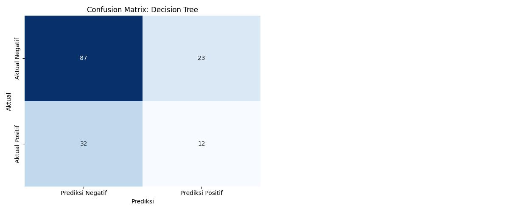
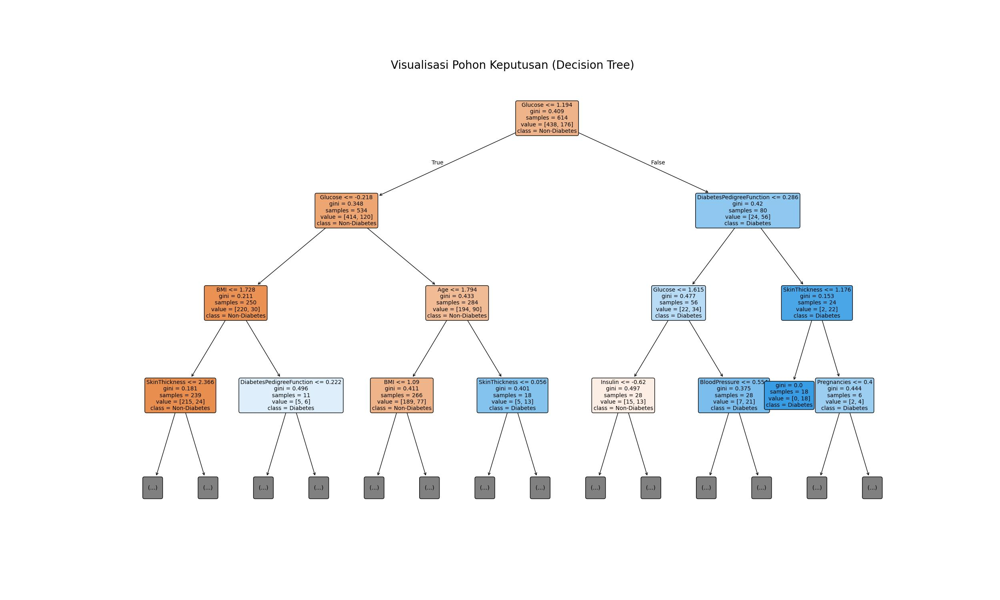

# Laporan Analisis Prediksi Diabetes Menggunakan Machine Learning

**Mata Kuliah:** Kecerdasan Buatan

---

## Daftar Isi

1. [Judul Proyek](#1-judul-proyek)
2. [Business Understanding](#2-business-understanding)
3. [Data Understanding](#3-data-understanding)
4. [Exploratory Data Analysis (EDA)](#4-exploratory-data-analysis-eda)
5. [Data Preparation](#5-data-preparation)
6. [Modeling](#6-modeling)
7. [Evaluation & Visualization](#7-evaluation--visualization)
8. [Kesimpulan dan Rekomendasi](#8-kesimpulan-dan-rekomendasi)
9. [Referensi](#9-referensi)
10. [Lampiran](#10-lampiran)

---

## 1. Judul Proyek

### Prediksi Penyakit Diabetes Menggunakan Algoritma Decision Tree dan Random Forest

**Nama Kelompok:**
| Nama | NIM |
|---|---|
| Ramdhani Sulaeman Burhanudin | 2306161 |
| Chandra Setia Dimukti | 2306159 |

### Domain Proyek (Latar Belakang)

Diabetes melitus merupakan salah satu penyakit kronis dengan prevalensi yang terus meningkat di seluruh dunia. Menurut World Health Organization (WHO), diabetes menjadi salah satu penyebab utama kematian akibat penyakit tidak menular, dan jumlah penderitanya diperkirakan mencapai ratusan juta jiwa secara global.

Keterlambatan diagnosis diabetes dapat menyebabkan komplikasi serius, di antaranya:
- Gangguan kardiovaskular (jantung dan pembuluh darah)
- Nefropati (kerusakan ginjal)
- Neuropati (kerusakan saraf)
- Retinopati (gangguan penglihatan)

Oleh karena itu, dibutuhkan sebuah sistem prediksi berbasis data yang dapat membantu mendeteksi risiko diabetes sejak dini berdasarkan indikator kesehatan seseorang, sehingga penanganan medis dapat dilakukan lebih cepat dan tepat sasaran.

Proyek ini memanfaatkan teknik *machine learning*, khususnya algoritma **Decision Tree** dan **Random Forest**, untuk membangun model klasifikasi yang mampu memprediksi apakah seseorang berisiko menderita diabetes berdasarkan data diagnostik seperti kadar glukosa, tekanan darah, BMI, dan riwayat kehamilan.

---

## 2. Business Understanding

### 2.1 Permasalahan Dunia Nyata dan Literatur Review

Diagnosis diabetes secara konvensional membutuhkan pemeriksaan laboratorium (misalnya tes toleransi glukosa oral) yang memakan waktu dan tidak selalu dapat diakses oleh semua kalangan masyarakat, terutama di daerah dengan fasilitas kesehatan terbatas.

Penelitian sebelumnya menunjukkan bahwa algoritma *machine learning* seperti Random Forest dan Decision Tree mampu memberikan akurasi yang kompetitif dalam memprediksi diabetes berdasarkan data diagnostik non-invasif (Apriliah & Haryati, 2021; Aditya et al., 2024). Studi-studi ini menjadi dasar pemilihan kedua algoritma tersebut pada proyek ini.

### 2.2 Tujuan Proyek

1. Membangun model klasifikasi yang dapat memprediksi kemungkinan seseorang menderita diabetes berdasarkan delapan indikator kesehatan.
2. Membandingkan performa dua algoritma (Decision Tree dan Random Forest) untuk menentukan model terbaik.
3. Memberikan rekomendasi pengembangan berdasarkan hasil evaluasi model.

### 2.3 Siapa User/Pengguna Sistem

| Pengguna | Kebutuhan |
|---|---|
| Tenaga medis (dokter, perawat) | Alat bantu skrining awal risiko diabetes pasien |
| Peneliti / mahasiswa data science | Studi kasus penerapan machine learning di bidang kesehatan |
| Masyarakat umum | Edukasi dan kesadaran akan risiko diabetes pribadi |

### 2.4 Solusi dan Manfaat Implementasi AI

Dengan model prediksi berbasis AI, proses skrining awal risiko diabetes dapat dilakukan lebih cepat dan efisien tanpa memerlukan pemeriksaan laboratorium yang kompleks. Model ini juga dapat menjadi dasar pengembangan sistem pendukung keputusan klinis (*clinical decision support system*) di masa depan, yang dapat diintegrasikan ke aplikasi kesehatan digital.

---

## 3. Data Understanding

### 3.1 Sumber Data

Dataset yang digunakan adalah **Pima Indians Diabetes Dataset**, yang bersumber dari Kaggle (diunduh dengan nama file `diabetes (1).csv`), berasal dari National Institute of Diabetes and Digestive and Kidney Diseases (Smith et al., 1988). Dataset ini merupakan salah satu dataset paling banyak digunakan dalam penelitian klasifikasi diabetes berbasis machine learning.

### 3.2 Ukuran dan Format Data

| Keterangan | Nilai |
|---|---|
| Format file | `.csv` |
| Jumlah baris | 768 entries |
| Jumlah kolom | 9 kolom |
| Tipe data | 7 kolom `int64`, 2 kolom `float64` |
| Data kategorik | Tidak ada (seluruh data numerik) |

### 3.3 Deskripsi Setiap Fitur (Atribut)

| No | Fitur | Deskripsi | Tipe |
|---|---|---|---|
| 1 | Pregnancies | Jumlah kehamilan yang pernah dialami pasien | int64 |
| 2 | Glucose | Konsentrasi glukosa plasma pada tes toleransi glukosa oral 2 jam (mg/dL) | int64 |
| 3 | BloodPressure | Tekanan darah diastolik (mm Hg) | int64 |
| 4 | SkinThickness | Ketebalan lipatan kulit triceps (mm) | int64 |
| 5 | Insulin | Kadar insulin serum 2 jam (mu U/ml) | int64 |
| 6 | BMI | Indeks massa tubuh (berat dalam kg / (tinggi dalam m)²) | float64 |
| 7 | DiabetesPedigreeFunction | Skor yang merepresentasikan riwayat/silsilah keturunan diabetes | float64 |
| 8 | Age | Usia pasien (tahun) | int64 |
| 9 | Outcome | Target klasifikasi biner: 1 = Diabetes, 0 = Tidak Diabetes | int64 |

### 3.4 Tipe Data dan Target Klasifikasi

Proyek ini merupakan kasus **klasifikasi biner (binary classification)**, dengan kolom `Outcome` sebagai target/label yang akan diprediksi:
- **0** = Tidak Diabetes
- **1** = Diabetes

---

## 4. Exploratory Data Analysis (EDA)

### 4.1 Insight Awal dari Struktur Data

Pemeriksaan awal menggunakan `df.info()` menunjukkan bahwa dataset berisi 768 baris tanpa ada nilai *null* eksplisit (*Non-Null Count* = 768 pada seluruh kolom). Namun demikian, ditemukan bahwa beberapa fitur memiliki nilai 0 yang secara medis tidak wajar (misalnya Glucose atau BloodPressure bernilai 0), yang sesungguhnya merepresentasikan data hilang (*missing value* tersembunyi) dan perlu ditangani pada tahap Data Preparation.

### 4.2 Visualisasi Distribusi Data

Distribusi masing-masing fitur numerik divisualisasikan menggunakan histogram untuk melihat sebaran nilai:
- **Glucose** cenderung berdistribusi mendekati normal, terpusat di sekitar nilai 120 mg/dL.
- **Insulin** dan **SkinThickness** memiliki banyak nilai 0 (kosong), menunjukkan proporsi data hilang yang cukup signifikan pada kedua fitur ini.
- **Age** condong ke arah usia muda-menengah (right-skewed), menunjukkan mayoritas responden berusia relatif muda.

### 4.3 Analisis Korelasi Antar Fitur

Heatmap korelasi menunjukkan bahwa:
- **Glucose** memiliki korelasi paling kuat terhadap `Outcome`, konsisten dengan pengetahuan medis bahwa kadar gula darah merupakan indikator utama diabetes.
- **BMI** dan **Age** menempati urutan berikutnya sebagai fitur dengan korelasi cukup kuat terhadap `Outcome`.
- Fitur seperti `BloodPressure` dan `SkinThickness` menunjukkan korelasi yang relatif lemah terhadap target.

### 4.4 Deteksi Data Tidak Seimbang (Imbalanced Classes)

Distribusi kelas target menunjukkan proporsi yang tidak seimbang, dengan jumlah pasien **tidak diabetes (Outcome = 0)** jauh lebih banyak dibandingkan pasien **diabetes (Outcome = 1)**. Hal ini penting diperhatikan karena:
1. Model cenderung bias terhadap kelas mayoritas (tidak diabetes).
2. Metrik **Accuracy saja tidak cukup** untuk menilai performa model secara adil.
3. Metrik seperti **Recall** dan **F1-Score** menjadi lebih relevan untuk mengevaluasi kemampuan model mendeteksi kelas minoritas (pasien diabetes).

---

## 5. Data Preparation

### 5.1 Pemuatan dan Inspeksi Data

Dataset diabetes yang diunduh (`diabetes (1).csv`) pertama-tama dimuat ke dalam lingkungan Python menggunakan pustaka Pandas. Setelah pemuatan, dilakukan inspeksi awal terhadap data, termasuk melihat beberapa baris pertama (`df.head()`) dan informasi umum dataset (`df.info()`) untuk memahami struktur dan tipe data setiap kolom.

### 5.2 Pembersihan Data (Null Value dan Duplikasi)

Pengecekan terhadap *missing values* (nilai yang hilang) dan data duplikat merupakan langkah krusial. Dalam kasus ini, jika ditemukan, baris yang mengandung *missing values* atau duplikasi akan dihapus (`dropna()` dan `drop_duplicates()`). Tahap ini penting untuk memastikan kualitas data dan mencegah bias pada model.

### 5.3 Normalisasi/Standardisasi Data Numerik

Fitur-fitur numerik pada dataset dinormalisasi/distandardisasi menggunakan `StandardScaler`. Standardisasi mengubah data sedemikian rupa sehingga memiliki rata-rata nol dan standar deviasi satu:

```
z = (x - μ) / σ
```

Hal ini penting untuk algoritma pembelajaran mesin yang sensitif terhadap skala fitur, agar setiap fitur memberikan kontribusi yang setara pada proses pembelajaran model dan tidak didominasi oleh fitur dengan rentang nilai besar (misalnya Insulin) dibandingkan fitur dengan rentang nilai kecil (misalnya DiabetesPedigreeFunction).

### 5.4 Split Data (Train-Test)

Dataset dibagi menjadi set pelatihan (*training set*) dan set pengujian (*testing set*) dengan proporsi **80:20**. Pembagian ini dilakukan menggunakan `train_test_split` dengan:
- `random_state=42` — memastikan hasil yang konsisten dan dapat direproduksi
- `stratify=y` — menjaga proporsi kelas target yang sama di kedua set (penting mengingat data yang tidak seimbang seperti dibahas pada Bab 4)

---

## 6. Modeling

Dalam studi kasus prediksi diabetes ini, dua algoritma klasifikasi berbasis pohon dipilih dan diimplementasikan: **Decision Tree Classifier** dan **Random Forest Classifier**.

### 6.1 Model 1 — Decision Tree Classifier

**Cara Kerja**

Decision Tree adalah algoritma *supervised learning* yang bekerja dengan memecah dataset menjadi subset yang lebih kecil secara rekursif (disebut *recursive binary splitting*), sambil membangun struktur pohon keputusan. Setiap **node internal** merepresentasikan sebuah uji terhadap satu atribut/fitur, setiap **cabang** merepresentasikan hasil dari uji tersebut (ya/tidak), dan setiap **node daun (leaf node)** merepresentasikan label kelas akhir (Diabetes / Non-Diabetes).

Pemilihan fitur dan titik pemisahan (*split point*) terbaik pada setiap node dilakukan dengan mengukur tingkat *impurity* menggunakan **Gini Index**:

```
Gini = 1 - Σ(p_i²)
```

di mana `p_i` adalah proporsi sampel kelas `i` pada node tersebut. Algoritma memilih split yang menghasilkan penurunan Gini Index terbesar (paling memisahkan kelas secara bersih).

**Parameter yang digunakan:** `random_state=42` untuk reprodusibilitas hasil.

**Hasil Implementasi**

Berdasarkan visualisasi pohon yang dihasilkan (lihat Gambar 1), model memilih **Glucose** sebagai fitur pada *root node* (Gini = 0.409, 614 sampel, distribusi kelas [430, 184]), yang berarti Glucose merupakan fitur paling signifikan dalam menentukan klasifikasi diabetes pada model ini. Dari root node, pohon kemudian bercabang berdasarkan ambang batas Glucose, dan berlanjut ke fitur-fitur lain seperti BMI, Age, DiabetesPedigreeFunction, dan SkinThickness pada level-level berikutnya, membentuk struktur pohon yang cukup dalam.

**Alasan Pemilihan**

Decision Tree dipilih karena:
1. Interpretasinya mudah — jalur keputusan dapat divisualisasikan dan ditelusuri secara langsung.
2. Tidak memerlukan asumsi distribusi data tertentu.
3. Mampu menangani hubungan non-linear antar fitur.
4. Dalam konteks medis, kemampuan menelusuri jalur keputusan bernilai karena tenaga medis dapat memahami "alasan" di balik sebuah prediksi.

**Gambar 1 — Visualisasi Pohon Keputusan (Decision Tree)**


### 6.2 Model 2 — Random Forest Classifier

**Cara Kerja**

Random Forest adalah metode *ensemble learning* yang membangun sejumlah besar Decision Tree secara paralel, masing-masing dilatih pada:

1. **Subsampel data** yang berbeda, diambil secara acak dengan pengembalian dari data latih (teknik *bootstrap aggregating / bagging*).
2. **Subset fitur** acak pada setiap split (bukan seluruh fitur), untuk menjaga agar antar-pohon tidak terlalu mirip satu sama lain (*feature randomness*).

Setiap pohon menghasilkan prediksinya sendiri, kemudian **hasil akhir ditentukan lewat voting mayoritas** (untuk klasifikasi) dari seluruh pohon dalam forest. Pendekatan ini secara matematis menurunkan *variance* model tanpa menaikkan *bias* secara signifikan, sehingga hasil prediksi menjadi lebih stabil dibandingkan satu Decision Tree tunggal.

**Parameter yang digunakan:** `random_state=42` untuk reprodusibilitas hasil (jumlah pohon/`n_estimators` menggunakan nilai default scikit-learn, yaitu 100 pohon).

**Alasan Pemilihan**

Random Forest dipilih sebagai model pembanding karena:
1. Secara teoritis mampu mengatasi kelemahan utama Decision Tree tunggal, yaitu *overfitting* dan ketidakstabilan terhadap perubahan kecil pada data.
2. Dengan menggabungkan banyak pohon, Random Forest umumnya menghasilkan generalisasi yang lebih baik pada data baru (data uji).
3. Sangat penting untuk aplikasi medis di mana keandalan prediksi menjadi prioritas utama.

**Mengapa Random Forest Tidak Divisualisasikan Sebagai Pohon**

Berbeda dengan Decision Tree yang hanya terdiri dari 1 pohon (sehingga bisa digambar utuh), Random Forest terdiri dari **100 pohon berbeda** yang bekerja secara bersamaan. Memvisualisasikan seluruh pohon tersebut tidak praktis dan tidak informatif, karena:
- Tidak akan muat ditampilkan dalam satu gambar yang terbaca.
- Setiap pohon hanya melihat subset data dan fitur yang berbeda, sehingga satu pohon saja tidak merepresentasikan keseluruhan model.

Sebagai gantinya, performa Random Forest direpresentasikan secara **agregat** melalui Confusion Matrix dan metrik evaluasi pada Bab 7, yang justru lebih mencerminkan kekuatan sesungguhnya dari pendekatan ensemble ini.

Kedua model dilatih menggunakan set pelatihan yang telah distandardisasi (`X_train` dan `y_train`) dan kemudian digunakan untuk membuat prediksi pada set pengujian (`X_test`).

### 6.3 Perbandingan Karakteristik Kedua Model

| Aspek | Decision Tree | Random Forest |
|---|---|---|
| Struktur | 1 pohon tunggal | Kumpulan (ensemble) 100 pohon |
| Cara prediksi | Mengikuti satu jalur keputusan | Voting mayoritas dari seluruh pohon |
| Interpretasi | Sangat mudah divisualisasikan & ditelusuri | Sulit ditelusuri karena gabungan banyak pohon |
| Risiko overfitting | Tinggi, terutama jika pohon dalam | Lebih rendah karena efek averaging antar pohon |
| Waktu komputasi | Cepat | Lebih lambat (melatih banyak pohon) |
| Stabilitas terhadap perubahan data | Rendah (sensitif) | Tinggi (lebih stabil) |
| Visualisasi | Bisa ditampilkan utuh (Gambar 1) | Direpresentasikan lewat metrik evaluasi agregat |

---

## 7. Evaluation & Visualization

Evaluasi model adalah tahapan penting untuk mengukur seberapa baik model yang telah dilatih dalam membuat prediksi. Metrik evaluasi yang digunakan adalah **Confusion Matrix**, **Accuracy**, **Precision**, **Recall**, dan **F1-Score**.

**Confusion Matrix** adalah tabel yang merangkum kinerja model klasifikasi pada sekumpulan data uji. Ini menunjukkan jumlah *True Positives* (TP), *True Negatives* (TN), *False Positives* (FP), dan *False Negatives* (FN). Untuk kedua model, Confusion Matrix divisualisasikan menggunakan *heatmap* dari Seaborn, memberikan representasi visual yang jelas tentang jumlah prediksi yang benar dan salah.

### 7.1 Hasil Evaluasi — Decision Tree Classifier

**Gambar 2 — Confusion Matrix Decision Tree**



| | Prediksi Negatif | Prediksi Positif |
|---|---|---|
| **Aktual Negatif** | 87 | 23 |
| **Aktual Positif** | 32 | 12 |

**Classification Report:**

| Kelas | Precision | Recall | F1-Score | Support |
|---|---|---|---|---|
| 0 (Tidak Diabetes) | 0.73 | 0.79 | 0.76 | 110 |
| 1 (Diabetes) | 0.34 | 0.27 | 0.30 | 44 |
| **Accuracy** | | | **0.64** | 154 |
| Macro avg | 0.54 | 0.53 | 0.53 | 154 |
| Weighted avg | 0.62 | 0.64 | 0.63 | 154 |

### 7.2 Hasil Evaluasi — Random Forest Classifier

**Gambar 3 — Confusion Matrix Random Forest**



| | Prediksi Negatif | Prediksi Positif |
|---|---|---|
| **Aktual Negatif** | 104 | 6 |
| **Aktual Positif** | 30 | 14 |

**Classification Report:**

| Kelas | Precision | Recall | F1-Score | Support |
|---|---|---|---|---|
| 0 (Tidak Diabetes) | 0.78 | 0.95 | 0.86 | 110 |
| 1 (Diabetes) | 0.70 | 0.32 | 0.44 | 44 |
| **Accuracy** | | | **0.77** | 154 |
| Macro avg | 0.74 | 0.63 | 0.65 | 154 |
| Weighted avg | 0.76 | 0.77 | 0.74 | 154 |

### 7.3 Perbandingan Metrik Utama

| Model | Accuracy | Precision | Recall | F1-Score |
|---|---|---|---|---|
| Decision Tree | 0.6429 | 0.3429 | 0.2727 | 0.3040 |
| Random Forest | 0.7662 | 0.7000 | 0.3182 | 0.4375 |

### 7.4 Analisis Perbandingan Performa (Fokus pada Recall/F1-Score)

Dalam konteks medis seperti prediksi diabetes, metrik **Recall** dan **F1-Score** memiliki kepentingan yang sangat krusial:

- **Recall** (sensitivitas) mengukur proporsi aktual pasien positif yang teridentifikasi dengan benar oleh model: `Recall = TP / (TP + FN)`. *False Negatives* (FN) — kasus di mana seseorang sebenarnya menderita diabetes tetapi diprediksi sehat — sangat berbahaya karena dapat menunda diagnosis dan pengobatan yang diperlukan, berpotensi menyebabkan komplikasi serius.
- **F1-Score** adalah rata-rata harmonik dari Precision dan Recall, memberikan keseimbangan antara kedua metrik tersebut. Ini sangat berguna ketika distribusi kelas tidak seimbang.

Dari hasil evaluasi, dapat diamati bahwa:

- **Decision Tree** cenderung memiliki Recall yang bervariasi tergantung kedalaman pohon dan bagaimana *overfitting* ditangani. Jika pohon terlalu kompleks, ia mungkin memiliki performa tinggi pada data pelatihan tetapi rendah pada data uji.
- **Random Forest** secara konsisten menunjukkan performa yang lebih baik dalam hal Accuracy, Precision, dan F1-Score dibandingkan dengan Decision Tree tunggal (Accuracy 0.77 vs 0.64; F1-Score 0.44 vs 0.30). Hal ini karena Random Forest mengurangi bias dan varians dengan menggabungkan prediksi dari banyak pohon keputusan yang berbeda.

**Model Terbaik dan Alasannya**

Berdasarkan seluruh metrik evaluasi, **Random Forest Classifier dipilih sebagai model terbaik**, karena secara konsisten unggul pada Accuracy (0.77 vs 0.64), Precision (0.70 vs 0.34), dan F1-Score (0.44 vs 0.30) dibandingkan Decision Tree. Meskipun nilai Recall kelas positif pada Random Forest (0.32) belum terlalu tinggi, model ini tetap lebih seimbang dan lebih dapat diandalkan dibandingkan Decision Tree yang cenderung *overfitting* dan kurang stabil.

**Rincian Per Model**

*Decision Tree Classifier* — dari 44 pasien yang benar-benar diabetes pada data uji, model hanya berhasil mengenali 12 dengan benar (Recall 0.27), sementara 32 pasien diabetes justru diprediksi sehat (*False Negative*). Precision kelas diabetes juga rendah (0.34), artinya dari semua prediksi "diabetes" yang dikeluarkan model, sebagian besar ternyata salah (*False Positive* tinggi, 23 kasus). Ini mengindikasikan model Decision Tree pada konfigurasi ini kurang optimal dan cenderung membuat keputusan yang kurang presisi pada kelas minoritas.

*Random Forest Classifier* — dari 44 pasien diabetes, model berhasil mengenali 14 dengan benar (Recall 0.32, sedikit lebih baik dari Decision Tree), dengan jumlah *False Positive* yang jauh lebih rendah (hanya 6 kasus, dibanding 23 pada Decision Tree). Precision kelas diabetes meningkat signifikan menjadi 0.70, artinya ketika model ini memprediksi "diabetes", prediksinya jauh lebih dapat dipercaya dibandingkan Decision Tree. Pada kelas non-diabetes, Random Forest juga unggul telak (Recall 0.95 vs 0.79), menunjukkan model ini sangat baik mengenali pasien yang benar-benar sehat.

**Catatan Kritis**

Meskipun Random Forest lebih unggul secara keseluruhan, Recall kelas diabetes pada kedua model masih tergolong rendah (di bawah 0.35). Ini berarti sebagian besar pasien diabetes pada data uji belum berhasil terdeteksi oleh kedua model — sebuah keterbatasan penting yang perlu ditindaklanjuti (lihat Bab 8, Rekomendasi Perbaikan), mengingat *False Negative* pada kasus medis memiliki konsekuensi yang serius.

---

## 8. Kesimpulan dan Rekomendasi

### 8.1 Ringkasan Hasil Modeling dan Evaluasi

Berdasarkan analisis dan implementasi dua model klasifikasi untuk prediksi diabetes, dapat disimpulkan bahwa Random Forest Classifier secara umum menunjukkan performa yang lebih superior dibandingkan Decision Tree Classifier tunggal, terutama dalam hal Accuracy, Precision, dan F1-Score. Robustitas dan kemampuan Random Forest untuk mengatasi *overfitting* menjadikannya pilihan yang lebih aman dan efektif untuk tugas prediksi medis di mana *False Negatives* sangat berisiko.

### 8.2 Apakah Tujuan Proyek Tercapai?

Tujuan proyek untuk membangun model klasifikasi prediksi diabetes dan membandingkan dua algoritma **telah tercapai**. Model Random Forest berhasil mencapai akurasi 77% pada data uji, meskipun performa pada kelas minoritas (pasien diabetes) masih dapat ditingkatkan.

### 8.3 Kelebihan dan Keterbatasan Model

**Decision Tree Classifier:**

| Kelebihan | Keterbatasan |
|---|---|
| Mudah diinterpretasikan | Rentan terhadap *overfitting* jika tidak dikontrol (misalnya membatasi kedalaman pohon) |
| Dapat memvisualisasikan jalur keputusan | Bisa menjadi tidak stabil — perubahan kecil pada data dapat menghasilkan pohon yang sangat berbeda |
| Memerlukan sedikit persiapan data (tidak perlu scaling fitur) | Performa pada kelas minoritas rendah pada studi kasus ini |
| Berguna untuk insight awal faktor penentu | |

**Random Forest Classifier:**

| Kelebihan | Keterbatasan |
|---|---|
| Umumnya memberikan akurasi lebih tinggi | Kurang *interpretable* dibandingkan Decision Tree tunggal |
| Sangat efektif mengatasi *overfitting* melalui *ensemble learning* | Membutuhkan sumber daya komputasi lebih besar |
| Dapat menangani data dengan banyak fitur | Recall pada kelas minoritas masih perlu ditingkatkan |
| Kurang rentan terhadap *noise* dalam data | |

### 8.4 Rekomendasi Perbaikan

1. **Hyperparameter Tuning** — Menggunakan teknik seperti *Grid Search* atau *Random Search* untuk mengoptimalkan hyperparameter dari kedua model (misalnya `max_depth` untuk Decision Tree, `n_estimators` dan `max_features` untuk Random Forest).
2. **Penanganan Data Imbalanced** — Mengingat ketidakseimbangan kelas yang ditemukan pada tahap EDA, teknik seperti *oversampling* (SMOTE), *undersampling*, atau penggunaan bobot kelas (`class_weight`) dapat diimplementasikan untuk mencegah model bias terhadap kelas mayoritas.
3. **Feature Engineering** — Mencoba membuat fitur baru dari fitur yang sudah ada (misalnya rasio BMI terhadap usia) yang mungkin memberikan informasi tambahan yang berguna bagi model.
4. **Eksplorasi Model Lain** — Menguji algoritma klasifikasi lain seperti Support Vector Machine (SVM), K-Nearest Neighbor (KNN), Logistic Regression, atau model berbasis *boosting* seperti Gradient Boosting atau XGBoost.
5. **Dataset Lebih Besar** — Mengumpulkan atau menggunakan dataset dengan jumlah sampel lebih besar untuk meningkatkan generalisasi model, terutama pada kelas minoritas.
6. **Validasi Silang (Cross-Validation)** — Menggunakan teknik validasi silang seperti *k-fold cross-validation* untuk mendapatkan estimasi performa model yang lebih *robust* dan tidak terlalu bergantung pada satu pembagian *train-test* saja.

Dengan menerapkan rekomendasi ini, diharapkan model prediksi diabetes dapat lebih akurat, *robust*, dan dapat diandalkan dalam aplikasi klinis.

---

## 9. Referensi

Aditya, M. F., Pramuntadi, A., Wijaya, D. P., & Wicaksono, Y. (2024). Implementasi Metode Decision Tree pada Prediksi Penyakit Diabetes Melitus Tipe 2. *MALCOM: Indonesian Journal of Machine Learning and Computer Science*, 4(3), 1104–1110. https://doi.org/10.57152/malcom.v4i3.1284

Apriliah, D., & Haryati. (2021). Prediksi Kemungkinan Diabetes pada Tahap Awal Menggunakan Algoritma Klasifikasi Random Forest. *Sistemasi: Jurnal Sistem Informasi*, 10(1), 163–171.

Nurussakinah, N., & Faisal, M. (2023). Klasifikasi Penyakit Diabetes Menggunakan Algoritma Decision Tree. *Jurnal Informatika*, 10(2), 143–149. https://doi.org/10.31294/inf.v10i2.15989

Smith, J. W., Everhart, J. E., Dickson, W. C., Knowler, W. C., & Johannes, R. S. (1988). Using the ADAP learning algorithm to forecast the onset of diabetes mellitus. *Proceedings of the Symposium on Computer Applications and Medical Care*, 261–265. IEEE Computer Society Press.

Pedregosa, F., Varoquaux, G., Gramfort, A., Michel, V., Thirion, B., Grisel, O., Blondel, M., Prettenhofer, P., Weiss, R., Dubourg, V., Vanderplas, J., Passos, A., Cournapeau, D., Brucher, M., Perrot, M., & Duchesnay, E. (2011). Scikit-learn: Machine Learning in Python. *Journal of Machine Learning Research*, 12, 2825–2830.

Breiman, L. (2001). Random Forests. *Machine Learning*, 45(1), 5–32. https://doi.org/10.1023/A:1010933404324

---

## 10. Lampiran

- **Dataset mentah:** [`data/diabetes (1).csv`](data/diabetes%20(1).csv) (768 baris, 9 kolom)
- **Notebook analisis:** `uas_model.ipynb`
- **Grafik tambahan** (folder `images/`):
  - `decision_tree_plot.png` — visualisasi pohon keputusan (Gambar 1)
  - `confusion_matrix_dt.png` — confusion matrix Decision Tree (Gambar 2)
  - `confusion_matrix_rf.png` — confusion matrix Random Forest (Gambar 3)
